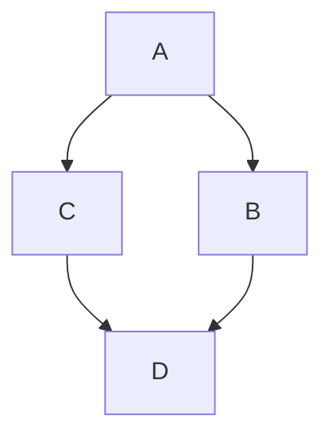
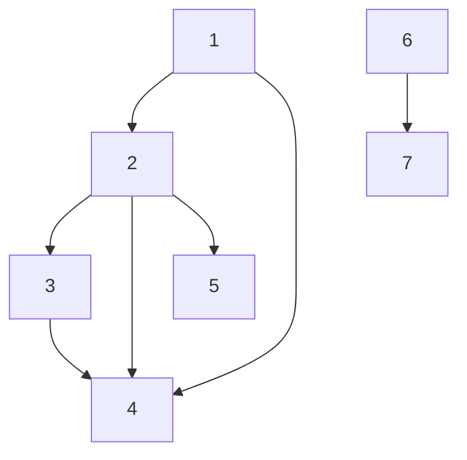

# KAHAN'S ALGORTIHM 

## OVERVIEW

- Is is used for finding a topological sort.
- It uses a modified BFS instead of using DFS
- This version for finding topological sort is used to prioritize some vertex.

### SOME THINGS TO NOTICE BEFORE STARTING.

- in_degree: Number of nodes that in the vertex, for example.

In the graph above the each vertex has next in_degree:

A: 0

B: 1

C: 1

D: 2

It means that in_degree is the number of edges that point to each vertex.

### KAHANS ALGORITHM IS BASED ON "in_degree" concept

The algorithm is based on prioritize the vertex with minimum in_degree, in such way that we only introduce in the priority queue vertex with in_degree equals to zero.

* WE ONLY INSERT IN THE QUEUE VERTEX WITH IN_DEGREE EQUAL TO 0, it is was got but has in_degree 0 then its in_degree will be decrease by one.

* That idea works because it will touched in_degree times , and we will introduce it to the priority_queue only in the las visit.

NOTE:

The priority queue just will sort the names of the vertex to take the minimun, but not take in count the in_degree value.

1. First will enter in the queue nodes 1 and 6 (they have in_degree 0)

2. We take off the vertex in the queue while this is not empty, and introduce each of its vertex only if it has in_degree 0, if not just decrease the in_degree by 1.

